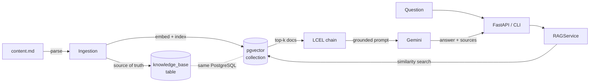

# ragchat

A retrieval-augmented Q&A service over a document knowledge base. Ask a question in
natural language; get an answer grounded in your content, with the source passages it
was drawn from.

Built on **PostgreSQL + pgvector**, **LangChain (LCEL)**, **Cohere** embeddings, and
**Google Gemini** — exposed as a **FastAPI** service and a **Typer** CLI.

[](https://github.com/Mohamed-AH/postgresslangchainchat/actions/workflows/ci.yml)


---

## Architecture

One datastore, two flows. PostgreSQL holds both the canonical text (`knowledge_base`
table) **and** the vector index (via pgvector) — there is no separate vector database to
run, pay for, or keep in sync.



The codebase is layered so each concern is isolated and independently testable:

| Layer | Module | Responsibility |
|-------|--------|----------------|
| Config | `ragchat.config` | Typed, validated settings from env / `.env` |
| Ingestion | `ragchat.ingestion.parser` | Markdown → structured `Section`s |
| Persistence | `ragchat.db.*` | SQLAlchemy models, engine, repository |
| Retrieval | `ragchat.rag.*` | Embeddings, pgvector store, LCEL chain |
| Orchestration | `ragchat.service` | `RAGService`: ingest + ask, dependency-injected |
| Interfaces | `ragchat.api`, `ragchat.cli` | FastAPI service and Typer CLI |

See [`docs/ARCHITECTURE.md`](docs/ARCHITECTURE.md) for the design decisions and trade-offs.

---

## Quickstart

### Run everything with Docker

```bash
cp .env.example .env      # then add your COHERE_API_KEY and GOOGLE_API_KEY
docker compose up --build
```

This starts PostgreSQL + pgvector and the API. Then load the sample corpus and ask a
question:

```bash
docker compose exec app ragchat ingest content.md

curl -s localhost:8000/ask \
  -H 'content-type: application/json' \
  -d '{"question": "What is a VPC?"}' | jq
```

Open <http://localhost:8000/> for the **web UI** (upload a file, then ask questions with
sources). Interactive API docs (OpenAPI/Swagger) are at <http://localhost:8000/docs>.

### Deploy it free

The whole thing runs on free tiers — **Render** (web UI + API) with **Neon** for
PostgreSQL + pgvector, and a **GitHub Actions** workflow for scheduled cleanup. A
`render.yaml` blueprint is included; see
**[DEPLOY.md](DEPLOY.md)** for step-by-step instructions. It's multi-tenant (per-session
isolation), with upload caps, per-session rate limits, a global daily budget, and
auto-expiring session data to protect the shared API keys.

### Run locally

```bash
make install                      # pip install -e ".[dev]"
# point DATABASE_URL at a pgvector-enabled PostgreSQL, set the API keys
ragchat ingest content.md
ragchat ask "What is a VPC?"
ragchat serve                     # start the API
```

---

## API

Each caller is an isolated **session** (a signed cookie): uploaded content and vectors
are namespaced per session, so users never see or overwrite each other's data. Each
visitor gets a small daily free allowance on the shared keys; beyond it they can supply
their **own** Cohere/Gemini keys via headers (`X-Cohere-Api-Key` / `X-Google-Api-Key`),
which are used per request and never stored — see [DEPLOY.md](DEPLOY.md#usage-limits--bring-your-own-keys).

| Method | Path            | Description |
|--------|-----------------|-------------|
| GET    | `/health`       | Readiness probe — runs `SELECT 1`; returns **503** if the DB is unreachable |
| POST   | `/ask`          | `{ "question": "..." }` → `{ "answer": "...", "sources": [...] }` (scoped to your session) |
| POST   | `/ingest/file`  | multipart upload of a `.md`/`.txt`/`.pdf`/`.docx` file → rebuilds your session's knowledge base (size/section caps enforced) |

---

## Development

```bash
make check     # ruff (lint + format), mypy --strict, and pytest
```

- **Tests run with no API keys and no live database.** Embeddings, the LLM, and pgvector
  are replaced with deterministic fakes; the relational layer runs on SQLite in-memory —
  so the suite is fast, hermetic, and safe for CI. See [Testing](docs/ARCHITECTURE.md#testing-strategy).
- **CI** (GitHub Actions) runs the exact same gates on every push and PR.
- **Typed throughout** and checked with `mypy --strict`.

Individual gates: `make lint`, `make typecheck`, `make test`.

---

## Tech stack

Python 3.11 · FastAPI · Typer · SQLAlchemy 2.0 · pgvector · LangChain (LCEL) ·
Cohere embeddings · Google Gemini · pydantic-settings · pytest · ruff · mypy · Docker

## License

MIT
