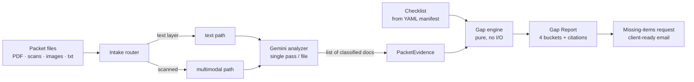

# Packet Auditor

Give it a **packet of documents** and a **checklist**; get back a structured **Gap
Report** of what's present, what's missing, what's deficient, and what a human should
double-check — every finding cited to the page it came from.

The first vertical is **Customs Pre-Clearance** (commercial invoice, packing list, bill
of lading, certificate of origin…), but the engine is vertical-agnostic: a new vertical
is a **declarative YAML checklist**, not new code. Education admissions, procurement,
healthcare credentialing, and study-visa funds ship as examples.

Built on **Google Gemini** (single-pass multimodal classify-and-extract), a pure Python
**gap engine**, and **FastAPI** + a **Typer** CLI. The project began life as a
retrieval-augmented Q&A service (see [Ask](#ask-the-secondary-flow) below), which
survives as a secondary feature.

**▶ Live demo: <https://packetaudit-ulfq.onrender.com/>** — pick a vertical, drop a packet,
read the Gap Report. Need documents to try it on? Generate sample packets at
<https://testsampledocs.netlify.app>. (Free hosting sleeps when idle, so the first request
may take a moment to wake.)

[](https://github.com/Mohamed-AH/postgresslangchainchat/actions/workflows/ci.yml)


---

## What "audit" means here

This is not retrieve-and-answer; it's **extract-and-verify against a rubric**. The report
has four states, and low-confidence reads are routed to `needs_review` rather than
emitting a false `missing`/`deficient`:

| State | Meaning |
|-------|---------|
| **present** | Required document/field found and consistent |
| **missing** | A required document or field was not found |
| **deficient** | Found, but fails a rule (malformed code, mismatched party, quantity discrepancy…) |
| **needs&nbsp;review** | Read with too little confidence to judge — a human should look |

Every finding carries a confidence score and a **source pointer** (`doc_id`, page,
snippet), so the report is auditable, not a black box.

The machine never has the last word: every audit is persisted, and a reviewer can
**accept** a verdict or **override** it (e.g. mark a `needs_review` field `present` after
checking it by hand, with a note). The report re-buckets to the effective, post-review
state — an overridden `missing` becomes `present`, the verdict flips, the missing-items
request re-renders — while the original machine verdict is kept for the audit trail. Past
audits are re-openable from a server-backed history.



A single combined multi-page PDF (all documents in one file, in any page order) is split
back into its constituent documents by the analyzer — one model call per file.

---

## Verticals are checklists, not code

Every vertical is the *same engine* with a *different checklist*. A checklist is a
**two-layer** structure expressed as declarative YAML in `src/ragchat/manifests/`:

- **Layer 1 — presence:** which document types the packet must contain.
- **Layer 2 — rules:** per-field and cross-document checks, composed from a fixed
  vocabulary of **check primitives** — `regex_match`, `numeric_match`,
  `cross_match` (text/entity), `date_valid`, `numeric_threshold` (min/max),
  `quantity_matches`.

Adding a vertical = dropping a `manifests/*.yaml` file in. **Zero engine/Python changes.**
The manifest is validated (Pydantic, discriminated on rule `type`) and compiled to a
`Checklist` at load. Shipped manifests: `customs`, `education_admissions`, `procurement`,
`healthcare`, `study_visa`.

```yaml
# a sketch — see src/ragchat/manifests/customs.yaml for the real thing
name: Customs Pre-Clearance
documents:
  - type: commercial_invoice
    required: true
    fields: [{ name: hts_code }, { name: total_quantity }]
rules:
  - type: regex_match
    doc_type: commercial_invoice
    field: hts_code
    pattern: '^\d{4}\.\d{2}\.\d{4}$'
    label: HTS code is well-formed
  - type: quantity_matches
    label: Invoice quantity matches packing list
```

---

## Quickstart

### Run the web app

```bash
make install                      # pip install -e ".[dev]"
export GOOGLE_API_KEY=...          # a Gemini key (audit uses Google only)
# point DATABASE_URL at a Postgres for run persistence
ragchat serve                     # start the API
```

Open <http://localhost:8000/> for the **web UI**: pick a vertical, drop the packet's
files (one combined PDF or several), and read the Gap Report — with **Copy / Download /
Print** to hand the missing-items request to a client. Light/dark, fully responsive,
keyboard-accessible. Interactive API docs are at <http://localhost:8000/docs>.

### Audit from the CLI

```bash
ragchat audit invoice.pdf packing_list.pdf bill_of_lading.png
```

The CLI audits against the active checklist (`ACTIVE_CHECKLIST`); the web app and
`POST /audit` let you pick the vertical per request.

### Deploy it free

Runs on free tiers — **Render** (web UI + API) with **Neon** for Postgres. A
`render.yaml` blueprint is included; see **[DEPLOY.md](DEPLOY.md)**. Set `GOOGLE_API_KEY`;
both `LLM_MODEL` (text path) and `VISION_MODEL` (scans) default to
`gemini-flash-lite-latest` — Flash-Lite is natively multimodal, so one generous free tier
reads both. Tune `MAX_FILES_PER_PACKET` and `ACTIVE_CHECKLIST`. It's multi-tenant
(per-session isolation) with upload caps and per-session rate limits; visitors can supply
their **own** Google key via the `X-Google-Api-Key` header, used per request and never stored.

**Model ladder.** The audit runs on **Gemini** (`AUDIT_MODEL_ORDER`, default `gemini`). A
provider-agnostic fallback ladder exists — the analyzer takes an ordered list of models and
fails over on quota/transient/malformed-output errors — but the free Mistral/Groq vision
models proved unreliable for this structured multi-document task in live testing, so they're
**off by default**. Their adapters remain in the code (`mistral`, `groq`, and a generic
`openai_compat` rung for any OpenAI-compatible endpoint); re-enable one by adding its id to
`AUDIT_MODEL_ORDER` and setting its key/URL. See [DEPLOY.md](DEPLOY.md#audit-model-ladder).

---

## API

| Method | Path            | Description |
|--------|-----------------|-------------|
| GET    | `/health`       | Readiness probe — `SELECT 1`; **503** if the DB is unreachable |
| GET    | `/checklists`   | Available audit verticals (`id` + display name) for the picker |
| GET    | `/providers`    | Diagnostic: the audit fallback ladder — which rungs are configured + resolved model ids (no secrets) |
| POST   | `/audit`        | multipart upload of the packet (+ optional `checklist_id`) → Gap Report + rendered missing-items request |
| GET    | `/audits`       | This session's audit history (newest first) with effective, post-review counts |
| GET    | `/audits/{id}`  | Re-open a past audit with reviewer decisions applied |
| POST   | `/audits/{id}/findings/{rid}/review` | Accept or override one finding's verdict |
| POST   | `/ask`          | *(secondary)* `{ "question": "..." }` → grounded answer + sources |
| POST   | `/ingest/file`  | *(secondary)* upload a file to build the Ask knowledge base |

---

## Ask — the secondary flow

The original retrieval-augmented Q&A path still exists: ingest a document, then ask
questions grounded in it with cited sources (PostgreSQL + pgvector, LangChain LCEL, Cohere
embeddings, Gemini). It is **not** on the audit path — auditing makes direct structured
Gemini calls with no vector store. See [`docs/ARCHITECTURE.md`](docs/ARCHITECTURE.md) for
how the two flows share the codebase without entangling.

---

## Development

```bash
make check     # ruff (lint + format), mypy --strict, and pytest
```

- **Tests run with no API keys and no live database.** The Gemini analyzer, embeddings,
  the LLM, and pgvector are replaced with deterministic fakes; the relational layer runs
  on SQLite in-memory — so the suite is fast, hermetic, and safe for CI.
- The audit **gap engine is pure** (no I/O) and exhaustively unit-tested; a hermetic
  **eval** (`tests/eval/`) gates Customs precision/recall at **1.0** against gold packets.
  Because Customs is loaded from `manifests/customs.yaml`, the green suite is also the
  manifest-compilation proof.
- **CI** runs the exact same gates on every push and PR. **Typed throughout**
  (`mypy --strict`).

Individual gates: `make lint`, `make typecheck`, `make test`.

---

## Tech stack

Python 3.11 · FastAPI · Typer · Google Gemini (multimodal) · Pydantic · SQLAlchemy 2.0 ·
Alembic · pytest · ruff · mypy · Docker. Secondary Ask flow adds pgvector · LangChain
(LCEL) · Cohere.

## License

MIT
